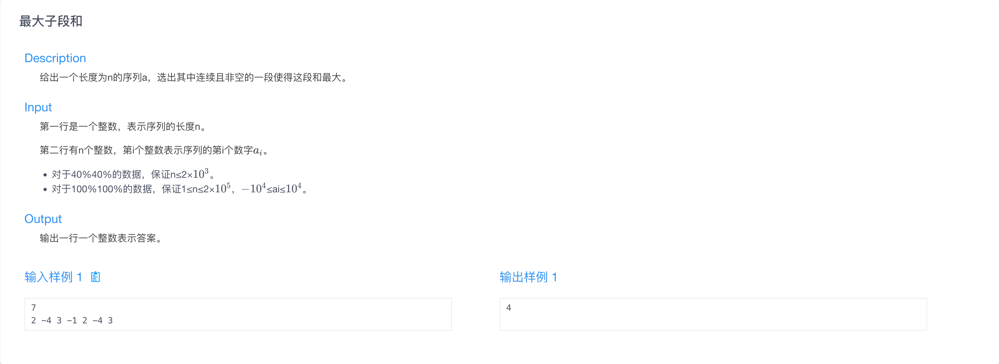
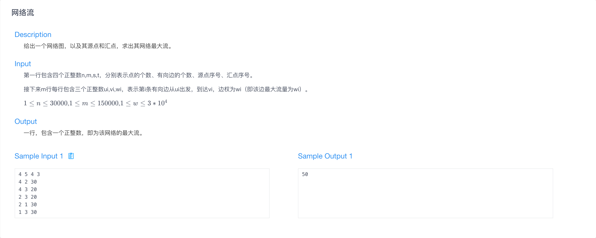

# MATH4002 算法基础 OJ 作业

## H1

### H1-1

### H1-2

### H1-3

### H1-4

## H2

### H2-1

### H2-2

### H2-3

### H2-4

## H3

### H3-1

### H3-2

### H3-3

## H4

### H4-1

### H4-2

### H4-3

### H4-4

### H4-5

### H4-6

## H6

### H6-1

### H6-2

### H6-3

## H7

### H7-1

### H7-2

### H7-3

## H8

### H8-1

### H8-2

### H8-3

